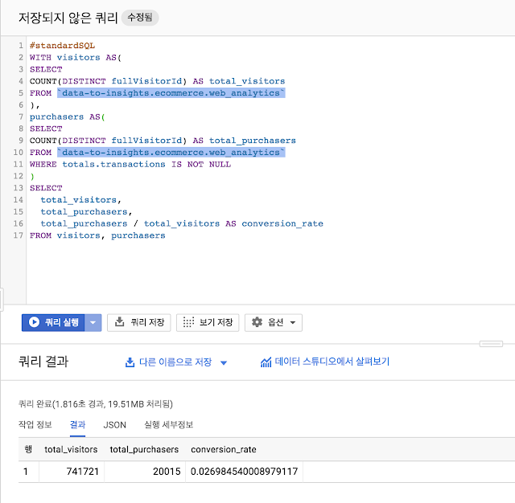
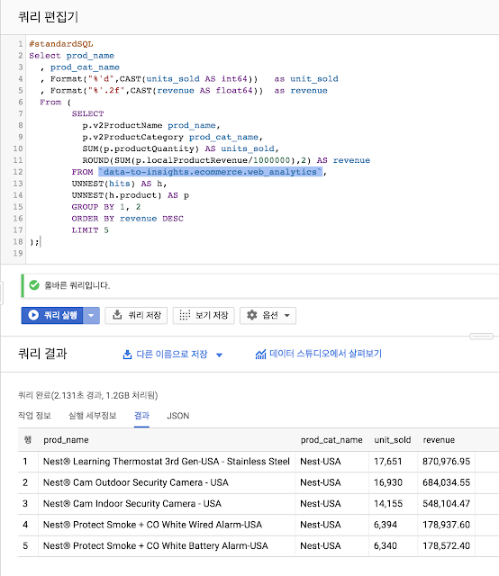

> [1. Big Query ML 이용해보기 (1) - Understanding Data(Business)](./Big-Query-ML-Use-(1))


이번 포스트에서는 Binary logistics Regressor를 이용한 Classification Model을 BigQuery ML을 이용하여 만들어 보고자 한다. 


앞서 이야기한대로 `BigQuery ML`은 Linear Regression(선형 회귀), Binary logistic regression(이진 로지스틱 회귀)의 모델을 생성 할 수 있다. `Linear Regressor`는 수치를 예측 하고자 할 때, `Binary logistics regression`은 분류 예측을 하고자 할때 사용한다. 

이번 Post는 `BigQuery ML`에 앞서 분석에 필요한 데이터를 탐색하는 것을 포스팅 해보도록 하겠다.


# 데이터 탐색 및 데이터 이해하기 (Understanding Business)

 우선 Machine Learning을 위해서는 데이터에 대한 이해 및 탐색. 그리고, 예측을 위해 필요한 데이터의 특성은 무엇인가에 대한 이해가 선행 되어야 한다. 아래 예제에서 사용하는  `data-to-insights.ecommerce.web_analytics` 는 BigQuery ML을 Test 하기 위해 Merchandise Store의 데이터를 공개한 것이다.

## 1. 방문자 대비 구매자

우선 데이터의 이해를 위해 전체 방문자 대비 구매자의 비율을 구하는 쿼리를 수행 해보도록 한다. 


>  
>
> ```sql
> #standardSQL
> WITH visitors AS(
> SELECT
> COUNT(DISTINCT fullVisitorId) AS total_visitors
> FROM `data-to-insights.ecommerce.web_analytics`
> ),
> purchasers AS(
> SELECT
> COUNT(DISTINCT fullVisitorId) AS total_purchasers
> FROM `data-to-insights.ecommerce.web_analytics`
> WHERE totals.transactions IS NOT NULL
> )
> SELECT
>   total_visitors,
>   total_purchasers,
>   total_purchasers / total_visitors AS conversion_rate
> FROM visitors, purchasers
> ```
>
>


 위의 데이터는 전체 방문자 대비 실제 구매자를 구하는 데이터이다. 위의 with절의 visitor는 방문자의 ID를 Count 하는 데이터이고, purchasers는 전체 데이터중 Transaction Flag가 있는 경우를 거래가 이루어진 것으로 보고, Count 한 데이터이다. 

<center>
    
	<br/>
    <em>< Fig. 1 - 방문자 대비 실제 구매자 ></em>
</center>


전체 방문자 수는 741,721명이며(이는 전체 방문 횟수가 아닌 전체 방문자의 수이다.) 이 방문자들 중 실제 구매 한 사람의 수는 20015명이다. 즉 
$$
(20,015\div741,721)\times100 = 2.69\%
$$
2.69%의 방문자가 Login 후 구매를 진행 하는 것을 알 수 있다. 


## 2. 매출과 수익 탐색

앞서 방문자와 실제 구매자를 알아 보았다. 하지만, 이것 만으로는 정보가 충분하지 않다. 방문자가 방문해서 구매를 했다 한들, 어떤 어떤 방문자가 어떤 카테고리의 제품을 찾았고, 어떤 제품을 구매 하였는가에 대한 탐색이 필요하다. 아래의 쿼리를 실행 해보자. 

>  
>
> ```sql
> #standardSQL
> Select prod_name
>   , prod_cat_name
>   , Format("%'d",CAST(units_sold AS int64))   as unit_sold
>   , Format("%'.2f",CAST(revenue AS float64))  as revenue
>   From (
>         SELECT
>           p.v2ProductName prod_name,
>           p.v2ProductCategory prod_cat_name,
>           SUM(p.productQuantity) AS units_sold,
>           ROUND(SUM(p.localProductRevenue/1000000),2) AS revenue
>         FROM `data-to-insights.ecommerce.web_analytics`,
>         UNNEST(hits) AS h,
>         UNNEST(h.product) AS p
>         GROUP BY 1, 2
>         ORDER BY revenue DESC
>         LIMIT 5
> );
> ```
>
>  
>
>
>
> <center>
>     
> 	<br/>
>     <em>< Fig. 2 - 매출 상위 5개 제품 ></em>
> </center>
>
>  
>
> >  위 Query는 전체 매출 중 가장 많이 팔린 상품 명과 수량에 대해, 상위 5개를 보여주는 쿼리이다.이때, From 절의 Inline View 쿼리 중 `UNNEST(hits)`, `UNNEST(h.product)`를 볼 수 있는데, 이는 해당 Table의 `Denormalize` 된 테이블의 Reapeat Column을 사용하는 것이고, Target Table의 Dataset의 1개의 Row에 대응되는 Repeat 컬럼에 대해 배열로 나열 하여, 연산 하는데 사용하려는 것이다. 다시 말해 Unnest Keyword는 Denormalize 된 Table의 Row에 대해 하나의 배열 타입으로 바꿔서 하나의 테이블로 인식 하는 역할을 해주는 것이다. 즉, Query 상에서 Table의 Row에 대해 1:N의 형태로 풀어 주는 역할을 한다. 
>
>


## 3. 정리

우리는 지금까지 간단하게 나마, Google의 Merchandise Store의 Data를 가지고 방문자와 실제 구매자, 그리고 매출 상위 5개의 제품에 대해 탐색 해보았다. 이것으로 이해 할지는 모르겠지만, 위에서 보는 것 처럼 `데이터를 이해 하는 것은 Business를 이해` 하는 것과 같다고 볼수 있을 것이다. 

가령, 위의 Dataset으로 방문자가 Site에 접속 하여 구매로 이어 지는 Pattern에 대해 분석을 하고 싶다고 가정을 하자. 접속하여 구매까지 이어지는 Pattern을 알기 위해서는 우선 사용자가 접속하는 경로부터 시작 해서 사용자가 검색한 검색어와 검색해서 나온 결과를 가지고 클릭한 제품의 종류, 그리고 제품을 구매하는데 제품에 대한 설명이 명시된 Page에 머문 시간 등, 여러 Factor를 가지고 고객의 구매 Pattern을 분석을 할 수 있을 것이다. 

하지만, 지금까지의 과정은 과거의 방문자수, 실제 구매자, 매출을 간단히 알아 본것에 불과 하며, 이를 분석 하기 위해서는 더 많은 데이터를 탐색 해야 하며, 실제 인입(Data Ingestion)된 데이터를 단계별로 분석 할 필요가 있고, 이는 반복적이고 많은 데이터를 필요로 할 것이다. 

Bigquery는 많은 데이터를 쌓기 좋은 대안이 될 것이고, 그 안에서 BigQuery ML은 데이터를 분석하기 위한 반복적인 작업을 획기적으로 줄여 줄것으로 기대 된다. 

다음은 BigQuery ML을 이용하여, 기존 단면적으로 보이는 데이터를 어떻게 통합하고, Machine Learning모델을 만드는지를 포스팅 해보도록 하겠다. 


