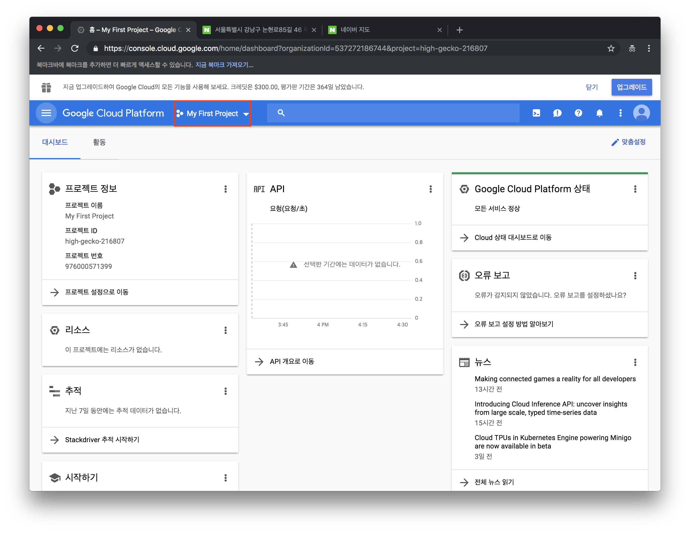
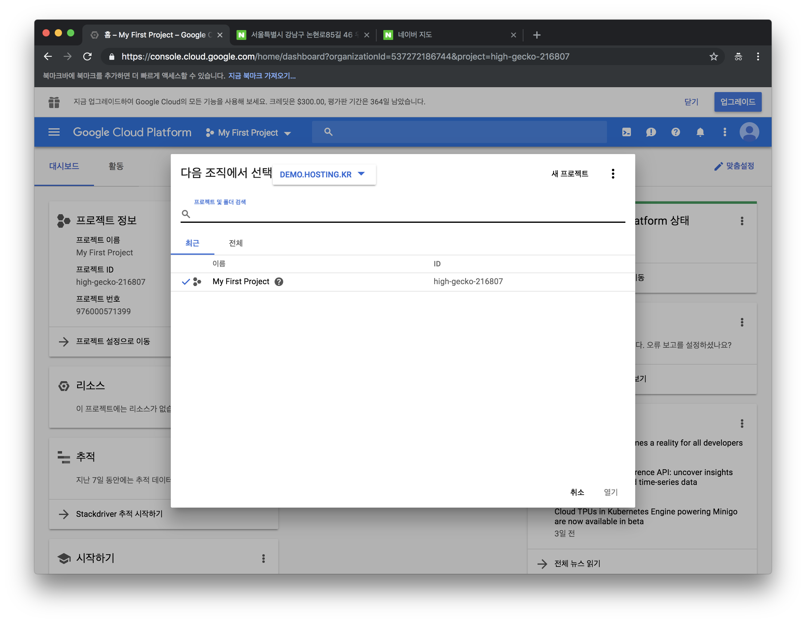
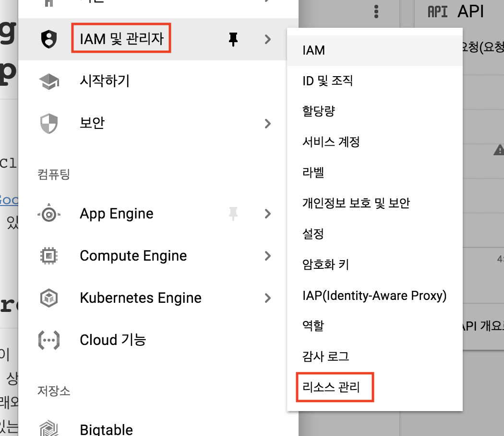
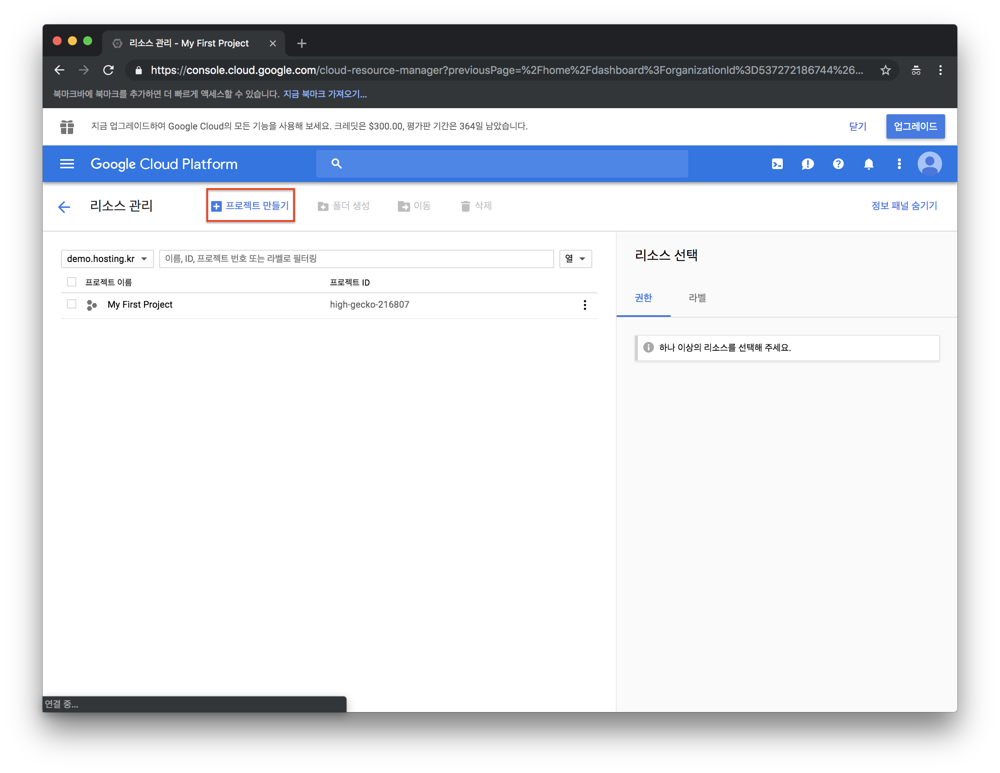
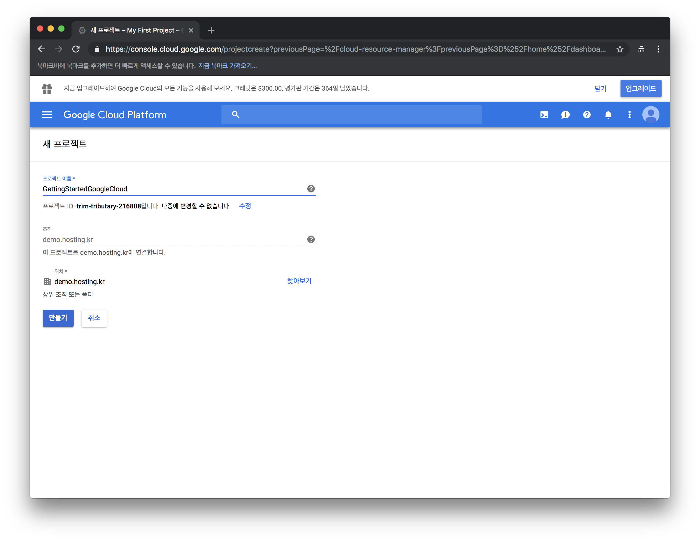

> [Google Cloud Compute Engine (1) - Project 생성하기]({{site.url}}/Google-Cloud-Compute-Engine-Usage-1)
>
> [Google Cloud Compute Engine (2) - Compute Engine Instance 생성]({{site.url}}/Google-Cloud-Compute-Engine-Usage-2)

이번 Post에서는 Google Cloud의 자원 중 Compute Engine을 사용하는 방법에 대해 알아 보도록 하겠다. [Google Cloud Compute Engine(GCE)](https://cloud.google.com/compute/)은 Google Cloud 내에 [가상 머신(Virtual Machine=VM)](https://ko.wikipedia.org/wiki/%EA%B0%80%EC%83%81_%EB%A8%B8%EC%8B%A0#%EA%B0%80%EC%83%81_%EB%A8%B8%EC%8B%A0_%EC%9D%91%EC%9A%A9_%EC%86%8C%ED%94%84%ED%8A%B8%EC%9B%A8%EC%96%B4)으로 Google Cloud의 [IaaS(Infrastructure as a Service)](https://ko.wikipedia.org/wiki/%EC%84%9C%EB%B9%84%EC%8A%A4%EB%A1%9C%EC%84%9C%EC%9D%98_%EC%9D%B8%ED%94%84%EB%9D%BC%EC%8A%A4%ED%8A%B8%EB%9F%AD%EC%B2%98)이다. Compute Engine을 이용하면, Google의 Peta byte급의 Network 및 Persistant Disk 등의 자원을 저렴하게 이용할 수 있고, 높은 수준의 [SLA(Service Level Agreement)](https://cloud.google.com/compute/sla)를 보장한다. 

Google Cloud의 Compute Engine Instance를 생성 하는 방법에는 2가지 방법이 있다. 

하나는, [Google Cloud Web Console](https://console.cloud.google.com/)에서 생성하는 방법과 다른 하나는 앞서 설치 한 [Cloud SDK](https://jay-pak.github.io/Google-Cloud-SDK-Install)를 이용한 방법이 있다. 그에 앞서 Project의 생성에 대해 먼저 알아 보도록 한다. 

## Project 생성 (Optional)

아래와 같이 Google Cloud Web Console로 접속 한다. 만약, Google Cloud Platform의 계정을 처음 활성화 한 상태라면, `My First Project`라는 Project 명이 보일 것이다. Test를 위해 간단히 할 것이라면, 처음 생성된 Project를 이용해도 무방하다. 그렇지 않고 신규로 생성하고 싶은 경우 아래와 같이 신규로 Project를 생성하도록 한다. 

 Google Cloud Platform의 구조는 아래와 같은 구조로 이루어져있으며, 개인 사용자의 경우 간단히 Account 아래 여러 Project가 Sub로 붙어 있는 구조이다. 우선 아래 그림 [Fig 1.1]에서 처럼 Project를 Click하면 그림[Fig 1.2]의 프로젝트 생성을 위한 화면을 볼 수 있다. 

    
	 
    <em>[Fig 1-1. Google Cloud Console Project 선택]</em>

    
	 
    <em>[Fig 1-2. Project 생성] </em>

다른 방법으로는 그림 [Fig 2-1]에서 처럼 옆 를 클릭 해서 `IAM 및 관리자` - `리소스 관리` Menu를 클릭 하도록 한다. 

    
	 
    <em>[Fig 2-1. Menu에서 리소스 관리 선택]</em>

    
	 
    <em>[Fig 2-2. 리소스 관리에서 Project 만들기 선택]</em>

    
	 
    <em>[Fig 2-3. Project 생성]</em>

Project 생성 시 `Project 이름`은 중복이 가능 하나, 아래 작은 글씨로 자동 생성된 `Project ID`는 다른 Google Cloud 내에 다른 Project들과 중복이 되면 안된다. 그리고, `Project ID`는 향후 변경 할 수 없으므로, 대규모 Project에서 여러 Project를 연결 할 경우 Naming Rule을 결정 할 필요가 있다. 이는 다음에 자세히 살펴보도록 한다. 

이번에는 Project 생성에 대해 알아 보았다. 전사(Enterprise)의 시각으로 보자면 Project의 생성은 곧 하나의 조직이 될수 있고, 이는 논리적인 하나의 업무 혹은 조직이 될 수 있으며, 조직의 구조는 Cloud에 있는 Landscape의 구조로 볼 수 있을 것이다. 때문에, Project의 구조를 잡는것은 관리적인 측면에서 아주 중요한 부분이 될 수 있을 것이고, 효율적인 IT 운영의 첫걸음이 될 수 있을 것이다. 

아직은 Cloud의 경험이 적어 이런 부분에 대한 포스팅을 하긴 어렵다. 이런 부분은 Project의 경험이 많이 필요하기 때문에, 향후 나중에 포스팅 할 기회가 있으면 해보도록 하려고 한다. 

다음은 본격적으로 Google Cloud Compute Engine의 생성/삭제에 대해 알아보도록 하겠다.