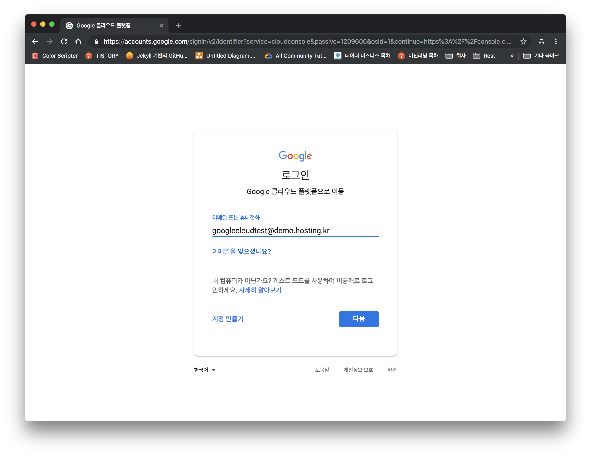
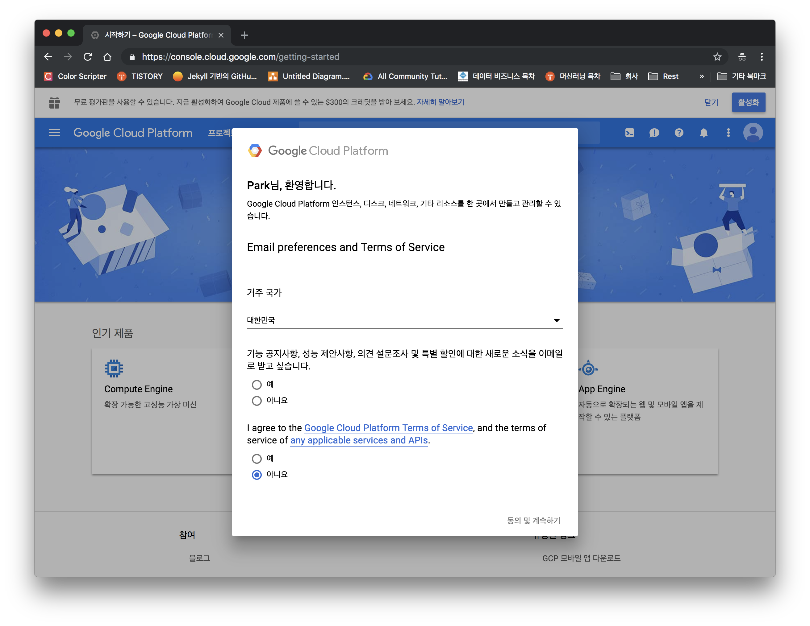
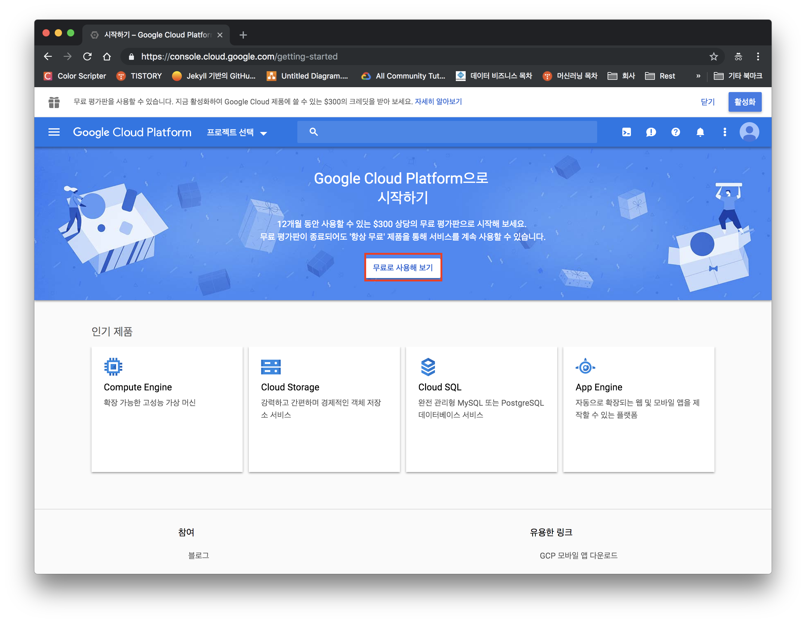
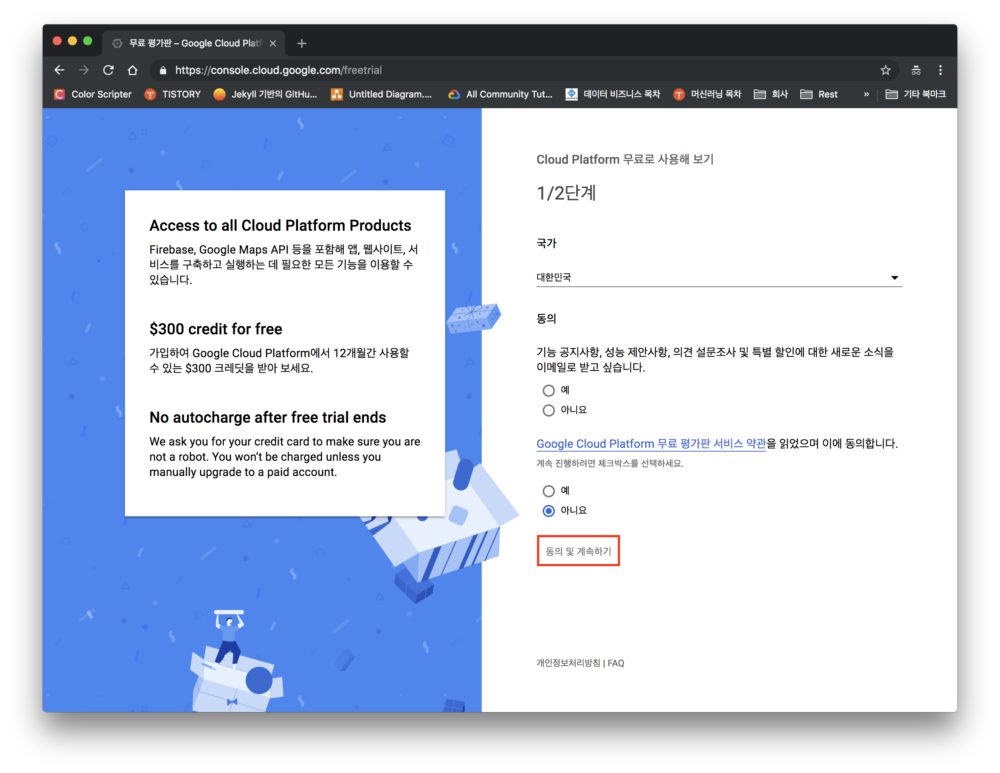
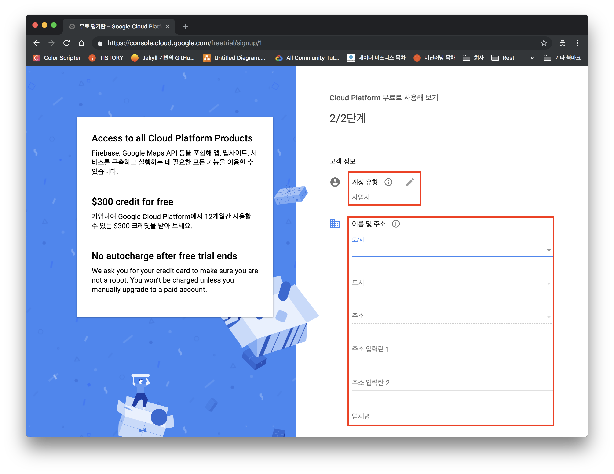
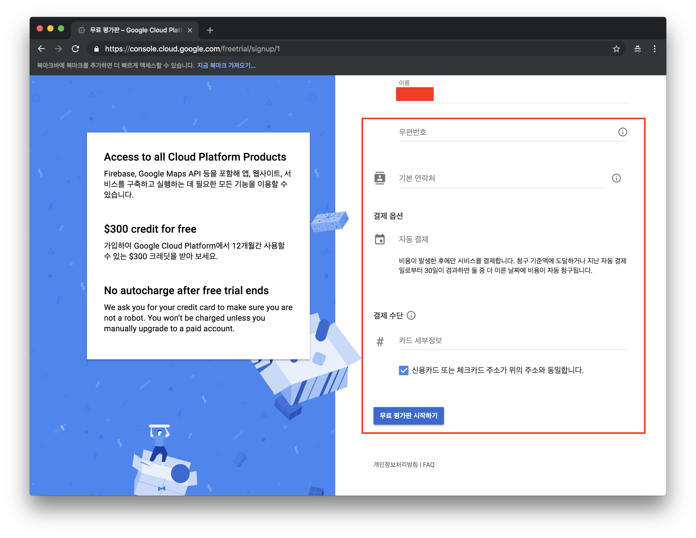

Google Cloud의 Service를 이용하기 위해서는 [Google Cloud Platform Console](https://console.cloud.google.com/)에 접속하여 사용 하면 되는데, Console에 접속 하기 위해서는 Google Cloud Platform에 가입절차를 거쳐야 한다. 가입을 위해서는 Gmail계정이나 Google의 Business [SaaS(Service as a Service)](https://ko.wikipedia.org/wiki/%EC%84%9C%EB%B9%84%EC%8A%A4%EB%A1%9C%EC%84%9C%EC%9D%98_%EC%86%8C%ED%94%84%ED%8A%B8%EC%9B%A8%EC%96%B4) Service인 G Suite서비스를 이용중 인 Mail계정이 필요하다. 이와는 별도로 계정에 연결할 신용카드가 필요한데, 해외 결제 가능 카드(VISA, Master, Union Pay etc..)면 사용 가능하다. 

Google은 가입하는 순간 300\$의 무료 Credit을 12개월 동안 사용 가능 하도록 제공한다. 그리고, 300\$의 Credit을 전부 사용 했거나, 12개월의 기간이 끝난다 하더라도 자동으로 과금이 되지 않고, 가입한 계정의 업그레이드를 해야지만 과금이 시작되므로, 잠시 Test를 위해 계정을 만들어서 신용카드를 연결 한다고 해서 사용료를 지불할 걱정은 하지 않아도 된다. 

## Google Cloud Platform 가입하기

우선 가입하기 위해 위에 언급 했던 Google Cloud Platform Console(Https://console.cloud.google.com)로 접속 한다.

Google Cloud Platform에 처음 접속하게 되면 아래와 같은 Login 화면이 나오게 된다. 이때, Gmail계정이나, G Suite으로 생성된 Mail계정을 입력 하도록 한다. 지금 입력 계정은 회사에서 Demo로 사용중인 G suite 계정이다. 

    
     
    <em>[Fig. 1 - Google Cloud Platform Login]</em>

Login에 성공하게 되면 아래와 같이 Welcome 화면이 나오며, Product에 대한 Update소식이나 Marketing에 대해 Mail로 받는 것에 동의여부를 묻는 화면이 나오는데 Marketing은 동의 하지 않아도 되지만 아래는 서비스 사용에 대한 동의를 묻는 것이기 때문에 동의를 하도록 한다. 

    
     
    <em>[Fig. 2 - Google Cloud Platform Login]</em>

위 절차를 끝내게 되면 아래와 같이 화면이 나오는데 이는 가입은 되었지만, Google Cloud Platform의 사용을 위한 활성화가 되지 않은 상태이다. 활성화를 위해 맨 위 오른쪽의 `활성화` 버튼이나, 아래 빨간 박스의 `무료로 사용해 보기`버튼을 클릭한다. 

    
     
    <em>[Fig. 3 - Google Cloud Platform 가입되었으나 활성화 되지 않은 상태]</em>

이제 활성화를 위해 아래 화면과 같이 동의 화면이 나오는데 앞서 `Fig 2`에 한 것 과 같이 설정하고 맨 아래 `동의 및 계속하기`를 클릭한다. 

    
     
    <em>[Fig. 4 - 활성화 단계 - 동의]</em>

동의 화면 이후 개인 정보와 결제 정보를 입력 한다. 

    
     
    <em>[Fig. 5 - 활성화 단계 - 사용자 정보 및 결제정보 1]</em>

    
     
    <em>[Fig. 6 - 활성화 단계 - 사용자 정보 및 결제정보 2]</em>

위에서 말했다 시피 결제 정보를 입력 했다 하더라도, 무료계정에서 업그래이드를 하지 않는 이상 결제가 되지 않는다. 다만, 카드의 유효성을 검사 하기 위해 1$ 결제되고 난후, 결제 취소가 될 수 있다. 

 이번 Post에서는 Google Cloud를 이용하기 위한 가입 절차를 살펴 보았다. 다음은 Google Cloud를 이용하기 위한 Google Cloud SDK를 설치 하는 방법에 대해 알아보도록 하겠다.

