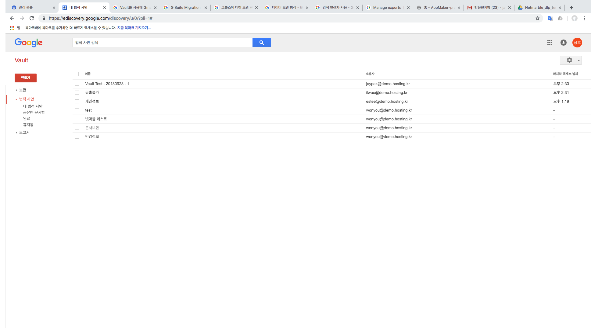
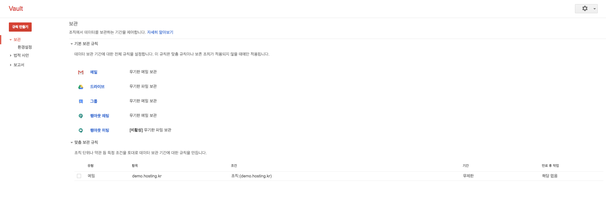

# Google Vault 란?

- [Google Vault](https://support.google.com/vault/answer/2462365?hl=ko)는 조직(혹은 특정 사용자나 Group)의 보관처리 및 디지털 증거 검색 요구 지원을 위해 데이터를 보관, 보존 처리, 검색하고 내보낼 수 있다. 

- Google Vault는 아래와 같은 Contents에 대해 기능을 제공한다. 
  - 이메일 메시지
  - 기록이 저장되도록 설정된 기본 행아웃 채팅 및 Google 토크 채팅
  - Google 그룹스
  - Google 드라이브 및 팀 드라이브의 파일
  - 행아웃 채팅의 대화

Google Vault의 기능은 아래와 같다. 

- **보관처리** — 보관 규칙을 설정하여 데이터가 사용자 계정에서 삭제되어 Google 시스템에서 삭제되기까지의 기간을 제어할수 있다. **[보관](https://support.google.com/vault/answer/2990828)**에 대해 자세히 알아보기
- **소송자료 보호** — 사용자에게 소송자료 보존 기능을 적용하여 데이터를 무기한 보존함으로써 법적 또는 기타 보존 의무를 이행합니다. [소송자료 보호](https://support.google.com/vault/answer/2473591)에 대해 자세히 알아보기
- **검색** — 사용자 계정, 조직 단위, 날짜, 키워드별로 도메인의 데이터를 검색합니다. Vault는 부울 검색, 와일드 카드 연산자 검색을 지원합니다. [검색](https://support.google.com/vault/answer/2462480)에 대해 자세히 알아보기
- **내보내기** — 추가 처리 및 검토를 위해 데이터를 내보냅니다. [내보내기](https://support.google.com/vault/answer/2473458)에 대해 자세히 알아보기
- **감사 보고서** — Vault 감사 보고서를 사용하여 특정 기간 동안 Vault 사용자가 취한 조치를 확인합니다. [감사](https://support.google.com/vault/answer/4239060)에 대해 자세히 알아보기

제공되는 기능과 Contents를 살펴 보면 Google Vault는 G Suite에서 생산되는 모든 Digital Contets에 대해 보관/보존 하며, 감사하는 기능을 제공한다. 뿐만 아니라, G suite 내의 사용자의 Contents 접속 시간 및 수정 시간을 추적 할 수 있으므로, Digital 자료의 유실 및 수정에 대해 추적 자료로도 사용 할 수 있다. Google Vault는 G suite Business, Enterprise 및 Education을 통하여 사용 가능하며, 개별 사용자당 월 5$의 요금을 통해 G suite Basic에서도 사용이 가능하다. 

# Google Vault 제공 Environment 

Google Vault는 2가지 방식으로 사용 할 수 있다. 

- [Web UI Console](https://ediscovery.google.com)
- [Google Vault API](https://developers.google.com/vault/)

Web Console에서는 Google Vault를 이용하여 감사 결과 및 Contents를 관리 하기 쉽게 보여 주며, 일회성의 작업에 적합한 것 처럼 보인다. 

만약 내부의 정책에 의해 G Suite의 내부 Contents의 데이터를 주기적으로 감사 하고, 해당 Contents의 분리보관 Process가 필요 하다면, API를 통한 In-House 개발을 통해 해결가능하다. 뿐만 아니라, MS Exchange에서 G suite으로 데이터를 Migration 하고자 한다면, **[G Suite Migration for Microsoft® Exchange](https://tools.google.com/dlpage/exchangemigration)**를 이용한 Migration이 가능 하다. 

## Google Vault Web Console 사용해 보기

### 1) Google Vault 보관 규칙 설정 하기. 

Google Vault의 G Suite에서 생산된 모든 Digital Contents에 대해 무기한 및 일정 기간 내에 보관 후 삭제 하거나, 이미 생산된 데이터에 대해 보존기간 이후 삭제를 할 수 있는 Option이 있다. 

보관을 지원하는 G Suite Service는 아래와 같다. 

- G Mail
- Drive
- Group 
- Hangout chat
- Hangout Metting 

여기서는 G Mail과 Drive에 대해 알아 보도록 하겠다. 아래 그림 [Fig. 1]은 Google Vault의 WebConsole의 접속 화면이다. 

    
	 
    <em>[Fig. 1 - Google Vault 초기화면]</em>

#### (1) Mail 보관 규칙 설정 하기 

- Google Vault에서 보관이라 함은 해당 사용자가 생산한 모든 Contents를 보관함을 뜻하며, 이는 내부의 Contents의 보관을 주기적인 삭제를 할 것인가, 아니면 무제한 보관을 할 것인가를 선택하게 된다. 
- Google Vault 초기 화면에서 왼쪽 메뉴의 보관을 클릭 하면 아래와 같은 화면을 볼 수 있다. 

    
	 
    <em>[Fig. 2 - Google Vault 보관 설정 화면]</em>

- 전사 조직이나 특정 조직의 모든 메일을 찾기 위해서는 