# Linux Docker 설치하기 ( With Google Cloud Compute Engine) - 1

사실 나는 개발쪽을 손을 놓은지 거의 5년이 되어 간다. 하지만 Cloud에 발을 들인 이상 개발쪽을 등한시 할 수 없어 다시 개발을 해보려고 한다. 사실 Data Engineering 일 혹은 Data Architect를 하면서 Meta Data를 수집 하기 위한 Thread Base의 Java Application을 간혹 개발을 했지만, Web Application에 대해 손을 놓은건 거의 5년이 넘어 가는 거 같다. 5년의 세월 동안 많은 변화가 있는거 같다. 솔직히 무슨 말을 하는지도 모르겠다. Cloud를 하게 되며, 이제는 개발을 등한시 해서는 Data 분석에 대한 시야가 슬슬 좁아진다는 생각이 들기 시작 했다. 모든 데이터 분석이나 혹은 Machine Learning의 시작은 양질의 데이터의 수집에서 시작된다는 것을 잠시 잊고 살았던거 같다. 자조 적인 개소리(?)는 여기서 집어 치우고, 다시 개발을 하기 위한 시작을 위해 우선 환경부터 만들어 보고자 한다. 사실 Kubernetes를 사용 할 수 있지만 Kubernetes를 사용 해보기 앞서 일단 Docker의 기초를 다지고자 Docker 위에 Nginx와 Tomcat부터 해보기로 했다. 

## Compute Engine Instance 만들기 

Compute Engine instance 만들기는 전에 Posting 한 [Compute Engine 만들기]({{site.url}}/Google-Cloud-Compute-Engine-Usage-2) 를 참조하기 바란다. 이때 주의 할점은 `http 트래픽 허용`과 `https 트래픽`을 허용 하도록 한다. 


## Docker 설치

Docker는 Windows나 Linux에서 설치 가능하다. 여기서는 Linux에서 설치 하도록 한다. 설치를 위해 아래 Script를 실행한다. 

```shell
sudo apt-get update 
sudo apt-get upgrade
sudo curl -fsSL https://get.docker.com/ | sudo sh
```

위 Script를 실행 하면 Docker의 설치가 시작 된다. Docker는 Root 계정 위에서 실행이 가능 하기 때문에 좀더 편리한 사용을 위해 아래 Script를 실행 한다. 

```shell
sudo usermod -aG docker $USER
```

위 Script를 추가 후 ssh를 shell을 다시 열어 보면 sudo를 제외 하고 docker를 이용할 수 있다. 

이제 Docker가 설치 되었다. 아래 명령으로 Docker가 제대로 설치 되었는지 확인을 해보면 된다. 

```shell
docker version
```

## Docker Image 얻기

이제 Docker가 설치 되었으니, Docker Container를 얻어야 한다. Docker는 Docker Hub에서 Image를 얻거나  DockerFile을 이용하여, Docker Image를 생성할 수도 있다. 여기서는 Docker hub에서 얻도록 한다. 

### Docker Image 검색

우선 아래 명령으로 Docker hub에 존재하는 Docker Image의 List를 보도록 한다. 

```shell
docker search tomcat
```

위 명령을 실행 하면 아래와 같이 Docker Hub에 존재하는 Docker Image의 List를 얻을 수 있다. 이때 `star` 를 보면 사람들이 추천하는 횟수를 볼 수 있다. 이를 기준으로 어떤 Image를 이용하면 된다. 

<center>
    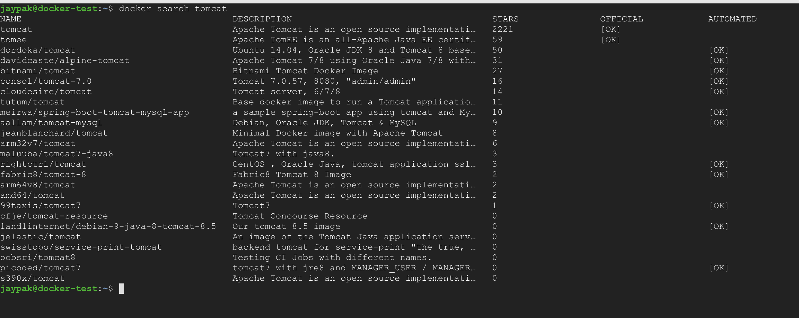
    <br/>
    <em>[Fig. 1 - Docker Hub Search]</em>
</center>

찾고자 하는 Docker Image를 찾았다면, 아래 Script로 Docker Image를 얻도록 한다. 

```shell
docker pull [Image Name]
```

우리는 tomcat을 설치 할 것이므로, tomcat의 이미지를 얻도록 한다.  

<center>
    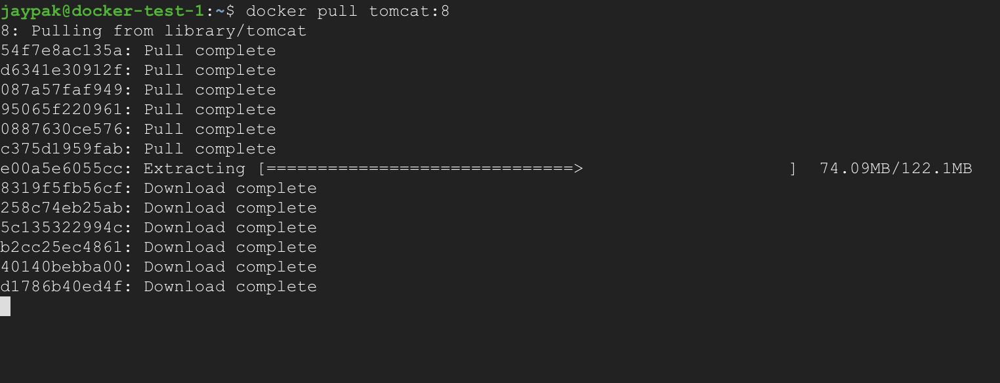
    <br/>
    <em>[Fig. 2 - Docker Image를 얻는다.]</em>
</center>

위에서 `docker pull tomcat:8`에서 `tomcat:8` 을 주목 하면, tomcat의 Image 중 뒤에 Tag 된 Tomcat의 Version이 설치된 image를 얻을 수 있다.  예를 들어 Tomcat 6 Version을 얻고 싶다면 아래와 같이 얻도록 한다. 다른 Image의 Tag 내용을 알고 싶다면 Docker Hub를 참조하기 바란다. 

<center>
    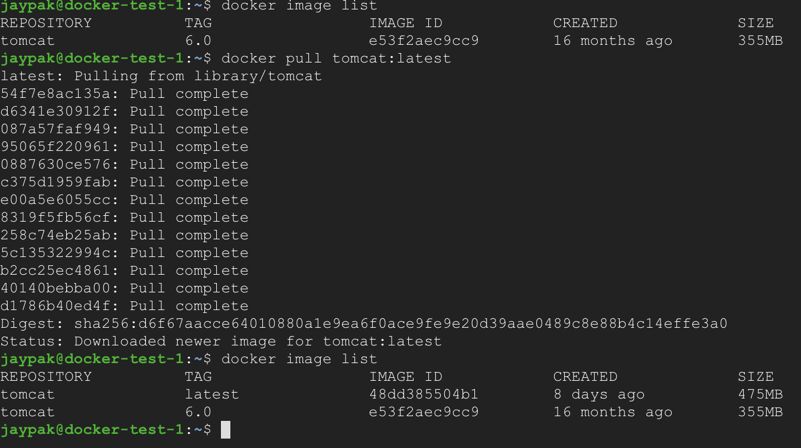
    <br/>
    <em>[Fig. 3 - 다른 버젼의 Tomcat Image를 얻기]</em>
</center>

여기서는 최신 버젼인 `latest` 를 사용하도록 한다. 아래와 같이 받은 docker image를 삭제 하도록 한다. 

<center>
    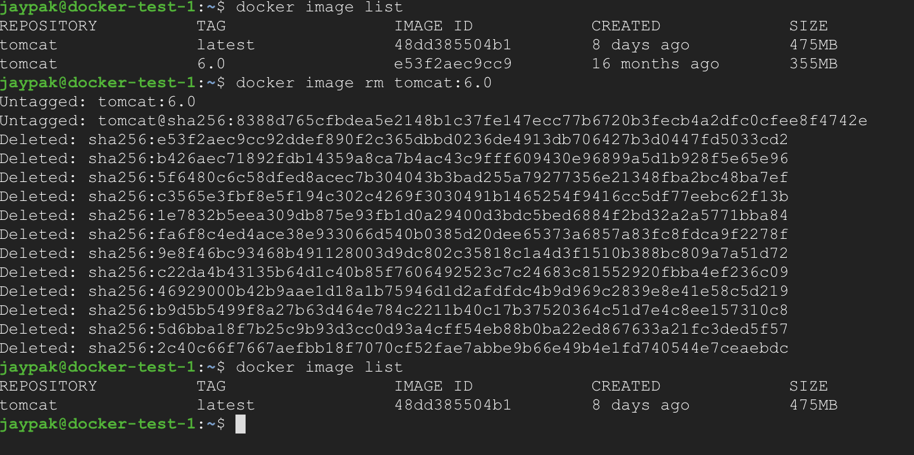
    <br/>
    <em>[Fig. 4 - Docker Image 삭제 하기]</em>
</center>

이제 Image를 얻었으니 Docker얻은 이미지로 Docker를 실행 하도록 한다. 

```shell
docker run -d tomcat:latest
```


<center>
    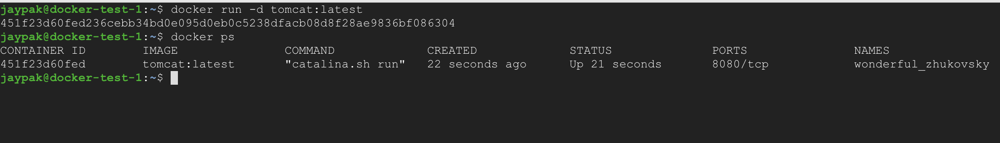
    <br/>
    <em>[Fig. 5 - Docker 실행 하기]</em>
</center>

위와 같이 docker Container가 실행 된것을 볼 수 있다. 이제 제대로 실행 되었는가를 확인 해보면 된다. 우선 Container의 IPAddress를 얻도록 한다. 

```shell
docker inspect [Container ID] | grep IPAddress
```

위와 같이 실행하면 아래와 같은 결과를 얻을 수 있다. 

<center>
    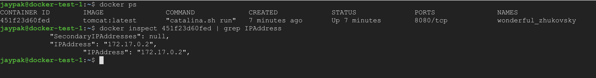
    <br/>
    <em>[Fig. 6 - IP Address 얻기]</em>
</center>

이후 Browser에서 확인을 해봤으면 좋겠지만.. 아직은 아니다. 좀 참도록 하자. 우선 curl 명령으로 test를 한다. 

<center>
    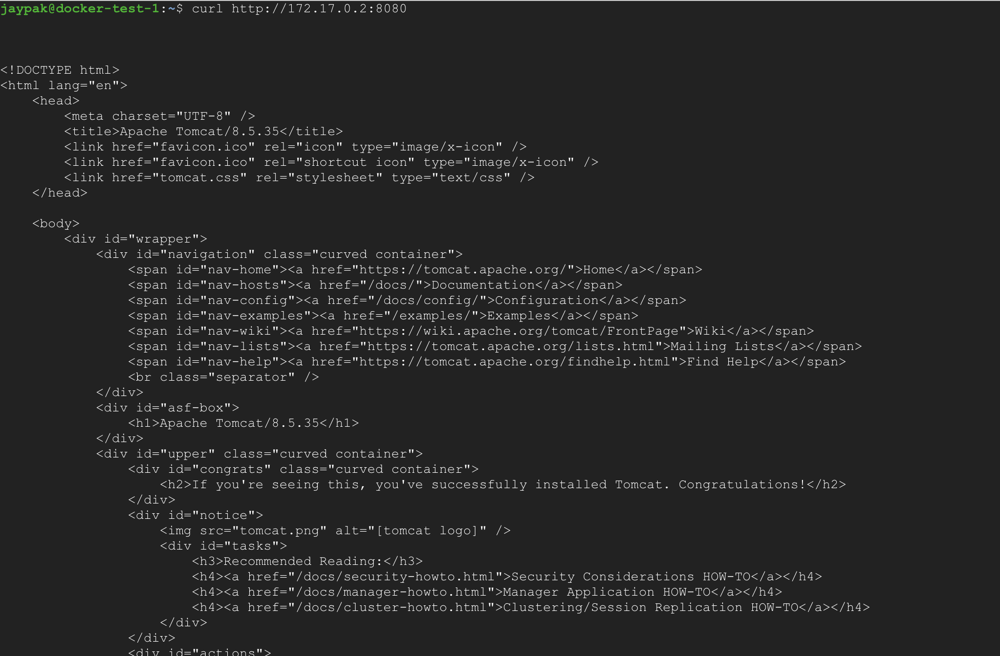
    <br/>
    <em>[Fig. 7 - curl test하기]</em>
</center>

정상적으로 돌아 가고 있는것으로 보인다. 이제는 자신의 노트북으로 고양이를 보고 싶을 것이다. 그렇게 하기 위해서는 우선적으로 조건이 있다. 

1. 방화벽 규칙 설정 하기
2. Compute engine Network Tag Update 

지금 부터 순차적으로 적용 해보록 한다. Main 화면의  를 클릭 해서 `네트워킹` - `VPC 네트워크` - `방화벽 규칙` Menu를 클릭 하도록 한다. 

<center>
    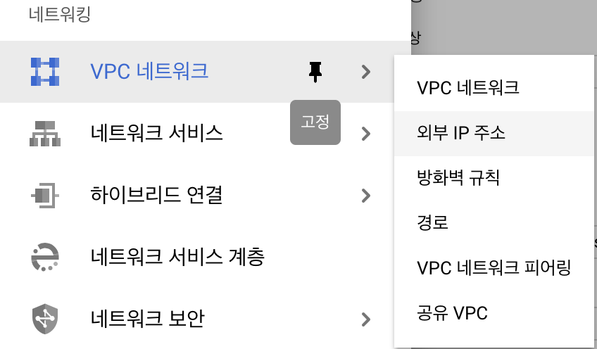
    <br/>
    <em>[Fig. 7 - 방화벽 규칙]</em>
</center>

<center>
    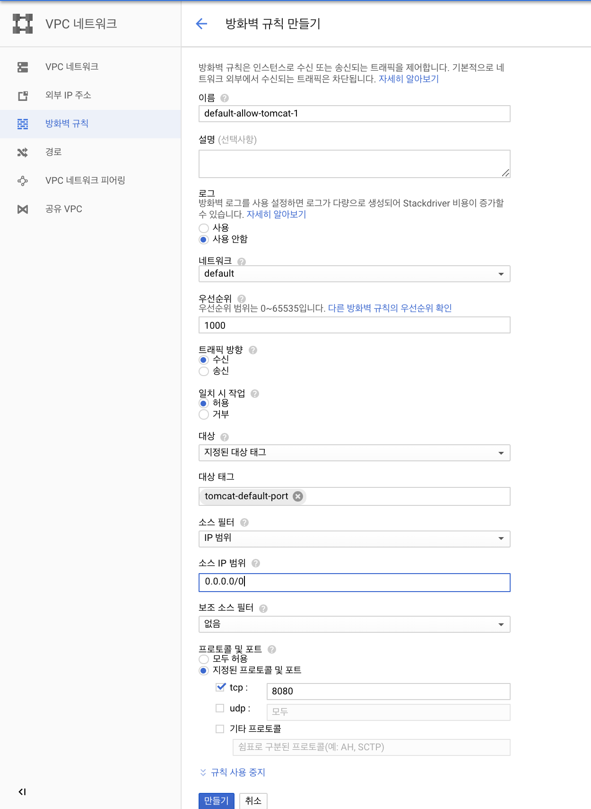
    <br/>
    <em>[Fig. 7-1 - 방화벽 규칙 설정하기]</em>
</center>

여기서 `대상 태그`의 이름을 기억해 뒀다가 아래와 같이 Compute engine Network Tag에 추가하도록 한다. 

<center>
    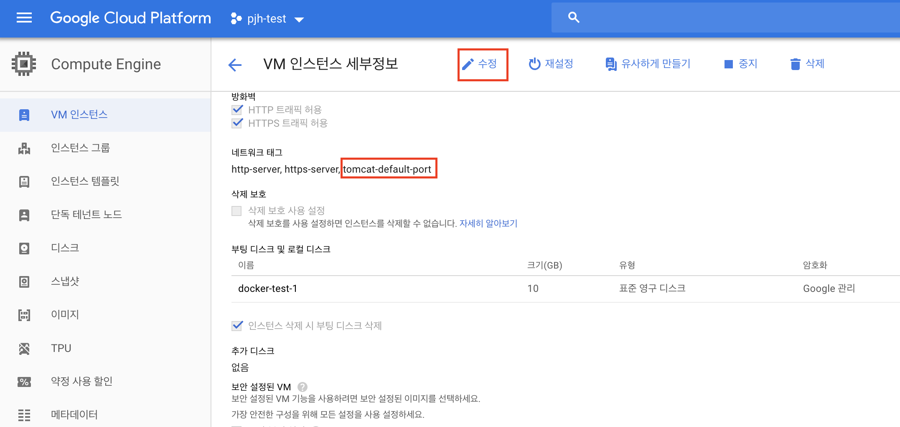
    <br/>
    <em>[Fig. 7-2 - Compute engine Config 변경]</em>
</center>


그리고 몇분 후 http://[External IP]:8080을 이용하여 Test해보도록 한다. 

<center>
    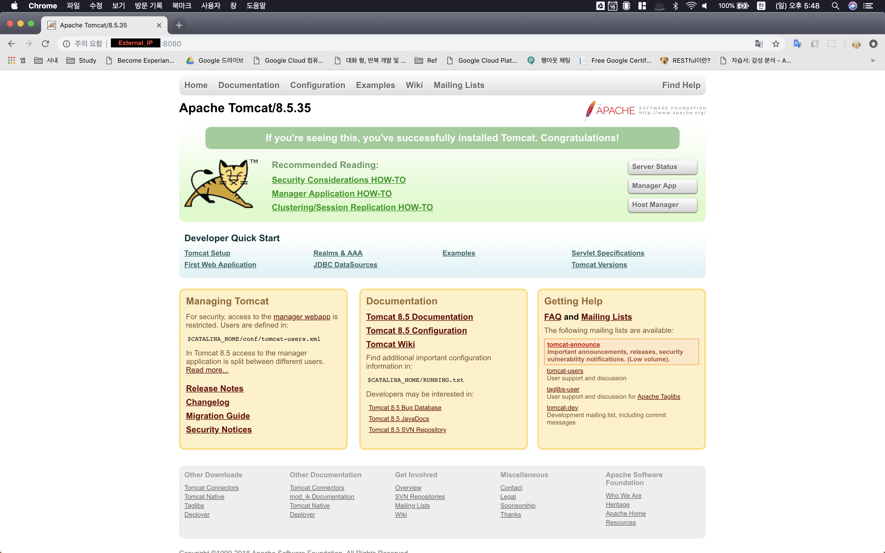
    <br/>
    <em>[Fig. 7-3 - Tomcat Test]</em>
</center>

다음은 nginx + Tomcat을 연동하는 것을 Posting을 해보도록 하겠다. 